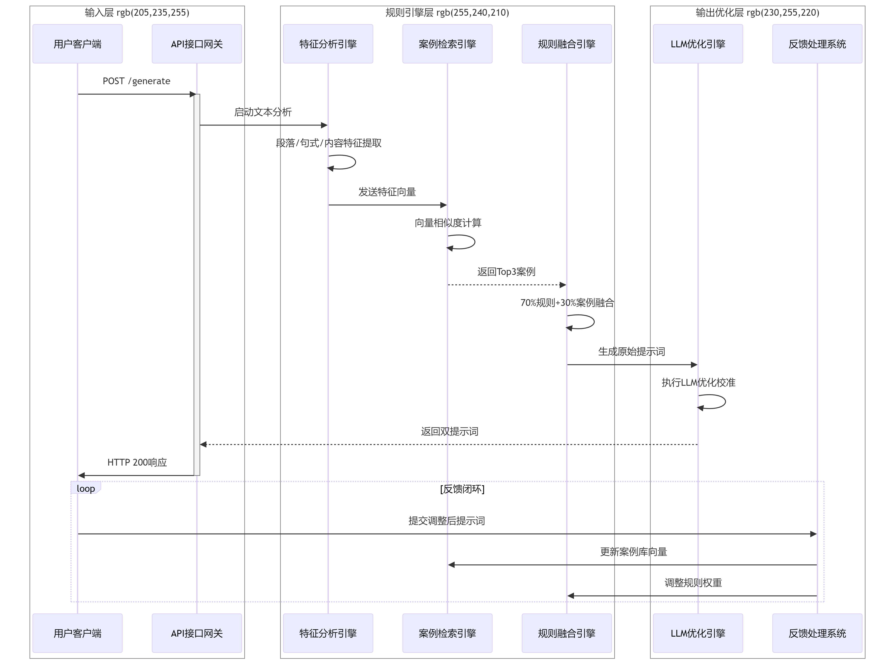

用户通过客户端发起HTTP POST请求至API接口网关后，系统首先由特征分析引擎对输入文本实施多维度解析（包括段落结构拆解、句式模式识别及语义内容标注），
生成结构化特征向量并触发案例检索引擎进行基于Sentence-BERT模型的向量相似度计算，
从案例库筛选出Top3相关历史模板，随后规则融合引擎通过动态加权策略将70%预设规则与30%案例特征混合生成初步提示原型，
紧接着LLM优化引擎对其进行四步校准——语法修正确保指令明确性、逻辑强化提升上下文连贯度、风格适配贴合用户历史偏好以及安全过滤规避敏感内容，
最终输出经优化的双版本提示词，在此过程中用户的反馈数据将同步回流至系统，既通过新增案例向量丰富案例库存储，
又动态调整规则引擎的权重配比，从而形成从请求响应、结果优化到经验沉淀的持续进化闭环，
使系统在反复迭代中不断增强对复杂场景的适应能力与输出稳定性。

